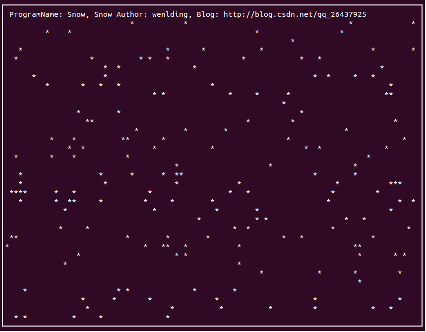

# linux安装ncurses库

ncurses相关介绍参考如下的文章
http://www.cnblogs.com/dandingyy/archive/2012/08/23/2651644.html

# linux C 随机数

利用了linux下自带的一些文件
参考如下的文章
http://blog.csdn.net/qin_zhangyongheng/article/details/8299147


# ncurse+线程 实现下雪的效果

ubuntu14.04测试成功
```
$make
$make run
```


# 参考
Linux下使用ncurses库和线程写的一个简单钟表程序
作者:枯龙吟
http://blog.163.com/lixiangqiu_9202/blog/static/53575037201251485740475/

